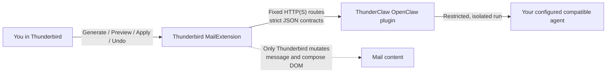

<p align="center">
  
</p>

<h1 align="center">ThunderClaw</h1>

<p align="center">
  <strong>OpenClaw-powered writing and reading assistance for Thunderbird.</strong>
  <br>
  Your inbox, your decisions, your control.
</p>

<p align="center">
  <a href="https://github.com/kwatson/thunderclaw/actions/workflows/ci.yml"></a>
  <a href="LICENSE"></a>
  <a href="docs/compatibility.md"></a>
  <a href="docs/roadmap.md"></a>
</p>

<p align="center">
  <a href="#what-it-can-do">Features</a> ·
  <a href="#how-it-stays-safe">Safety</a> ·
  <a href="docs/installation-and-pairing.md">Installation</a> ·
  <a href="docs/development.md">Development</a> ·
  <a href="CONTRIBUTING.md">Contributing</a>
</p>

> [!IMPORTANT]
> ThunderClaw is preparing its first public release. The code and documentation
> are open for review and contribution, but installable release artifacts are
> not published yet. Follow the [roadmap](docs/roadmap.md) for release progress.

> [!NOTE]
> **OpenClaw requirement:** ThunderClaw requires OpenClaw `2026.7.2-beta.7` or
> newer. See the [compatibility policy](docs/compatibility.md) for details.

## AI assistance without handing over your inbox

ThunderClaw brings useful writing and reading tools into desktop Thunderbird
while keeping Thunderbird—and you—in charge. A model can propose an edit,
summary, or translation. It cannot send mail, silently rewrite a message, or
change recipients, attachments, or headers.

Every compose change follows the same deliberate flow:

**Generate → Preview → Apply → Undo**

The current Thunderbird content remains authoritative throughout. Results are
validated on both sides of the connection, and stale results fail closed.

## What it can do

| In the composer | In a received message |
| --- | --- |
| Improve, proofread, shorten, or change tone | Create a separate plain-text summary card |
| Translate or summarize selected draft text | Reversibly translate visible message text |
| Follow a custom writing instruction | Preserve the message's original HTML structure |
| Preview before applying and undo afterward | Leave the original message untouched |

Thunderbird 128 and newer support plain selected-text transformations.
Qualified Thunderbird 153 and newer selections can also preserve or produce
narrowly typed rich content: paragraphs, flat lists, and bold, italic, or
underlined spans. Unsupported shapes are rejected rather than guessed at.

See the [product contract](docs/product-contract.md) for exact capability and
eligibility rules.

## How it stays safe

Email is untrusted input, so ThunderClaw is intentionally narrow by design.

- **Thunderbird owns every mutation.** Models return strictly validated data,
  never HTML to insert into a message.
- **Sending stays ordinary and manual.** ThunderClaw cannot invoke Send or
  alter recipients, attachments, or headers.
- **Model runs are isolated.** The selected compatible OpenClaw agent runs with
  in-memory sessions, model-callable tools disabled, and trajectory disabled.
- **Results are bound to their context.** Request identity, generation, target
  hashes, context hashes, output limits, and segment IDs prevent stale or
  misplaced changes.
- **Credentials stay scoped.** Thunderbird stores only its narrow paired
  ThunderClaw credential—never provider keys or a broad Gateway token.
- **The boundary is reviewable.** The extension and plugin communicate only
  over fixed HTTP(S) routes, with independent validators on each side.

Read the full [security and privacy model](docs/security-and-privacy.md) and
[architecture](docs/architecture.md).

## Architecture

ThunderClaw has exactly two independently packaged components:



There is no native helper, Native Messaging host, alternate transport, or
OpenClaw core patch. Provider, model, agent, and provider-key configuration
remain in OpenClaw.

## Installation and pairing

ThunderClaw requires OpenClaw `2026.7.2-beta.7` or newer. See the
[compatibility policy](docs/compatibility.md) before installing.

A release consists of two matching-version artifacts:

1. the ThunderClaw Thunderbird MailExtension; and
2. the `@thunderclaw/openclaw-plugin` package for OpenClaw.

Thunderbird initiates pairing and displays a short approval code. An
authenticated OpenClaw operator approves the matching request with:

```text
openclaw thunderclaw
```

The user then explicitly claims that approval in Thunderbird. Approval and
claim are separate decisions; neither happens automatically. See
[installation and pairing](docs/installation-and-pairing.md) for the complete
flow and [development](docs/development.md) for running from source today.

## Development

ThunderClaw uses Node.js through [`mise`](https://mise.jdx.dev/):

```bash
mise exec -- npm ci
mise exec -- npm test
mise exec -- npm run typecheck
mise exec -- npm run build
```

The monorepo keeps both sides of the boundary reviewable together while
packaging them independently:

```text
packages/openclaw-plugin/         OpenClaw plugin and package metadata
packages/thunderbird-extension/   Thunderbird extension source and icons
test/                             Unit, contract, lifecycle, and boundary tests
e2e/                              Real Thunderbird and qualification tooling
fixtures/                         Cross-boundary conformance fixtures
scripts/                          Build and qualification entry points
docs/                             Product, protocol, security, and release docs
```

Shared fixtures test conformance, but each component independently validates
the runtime contract across the HTTP boundary. Start with the
[development guide](docs/development.md), [testing guide](docs/testing.md), and
[contribution guide](CONTRIBUTING.md).

## Project status

ThunderClaw is working toward its first public release candidate. The remaining
gates include Windows and remote-HTTPS qualification, pairing CLI coverage, and
qualification of the exact distributable bytes. The
[roadmap](docs/roadmap.md) is the authoritative list of unfinished work.

Bug reports, documentation improvements, tests, and focused code changes are
welcome. For substantial behavior, protocol, dependency, or UI changes, please
open an issue before investing in an implementation.

## Documentation

- [Architecture](docs/architecture.md) — component ownership and data flow
- [Product contract](docs/product-contract.md) — supported behavior and review boundaries
- [Compatibility](docs/compatibility.md) — supported runtimes and upgrade policy
- [Security and privacy](docs/security-and-privacy.md) — trust, credentials, disclosure, and residual risks
- [Installation and pairing](docs/installation-and-pairing.md) — installation and operator/user pairing
- [Development](docs/development.md) — development environment and plugin updates
- [Testing](docs/testing.md) — test layers and qualification matrices
- [Release process](docs/release.md) — artifact acceptance and publication policy
- [Protocol reference](docs/reference/) — normative boundary contracts
- [Brand](docs/brand/) — assets, specification, licensing, and provenance

## Community and license

Please read [CONTRIBUTING.md](CONTRIBUTING.md) before opening a pull request and
use [SECURITY.md](SECURITY.md) for private vulnerability reports. Community
participation is governed by the [Code of Conduct](CODE_OF_CONDUCT.md).

Code, documentation, and project-owned assets are licensed under the
[Apache License 2.0](LICENSE). The ThunderClaw name, logo, and character are
also covered by the [trademark policy](TRADEMARKS.md).

---

<p align="center">
  <strong>Want safer AI assistance in Thunderbird?</strong><br>
  Star ThunderClaw to follow the journey—and help more Thunderbird users find it. ⚡
</p>
